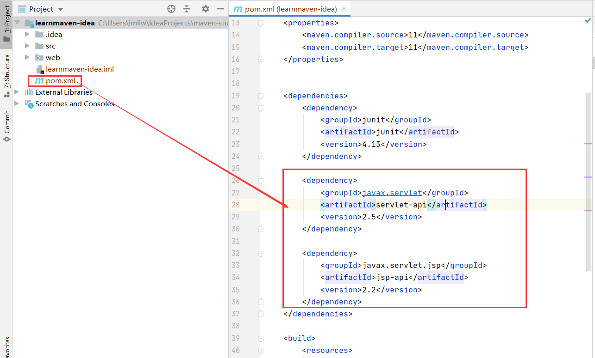

#learnmaven-base
##为什么需要maven
1.传统开发项目的问题，没有使用maven管理的项目

  （1）很多模块，模块之间有关系， 手工管理关系，比较繁琐。
  
  （2）需要很多第三方功能， 需要很多jar文件，需要手工从网络中手动获取各个jar包。
  
  （3）需要管理jar的版本， 你需要的是mysql.5.1.5.jar，那就不能给你一个mysql.4.0.jar。
  
  （4）管理jar文件之间的依赖， 你的项目要使用a.jar 需要使用b.jar里面的类。
   必须首先获取到b.jar才可以， 然后才能使用a.jar。
   
   （5）a.jar需要b.jar这个关系叫做依赖， 或者你的项目中要使用mysql的驱动， 也可以叫做项目依赖mysql驱动。a.class使用b.class， a依赖b类
   

2.什么是maven

maven 是目前最流行的自动化构建工具，对于生产环境下多框架、多模块整合开发有重要作用，maven 是一
款在大型项目开发过程中不可或缺的重要工具。


3.需要改进项目的开发和管理，需要maven
Maven 可以整合多个项目之间的引用关系，我们可以根据业务和分层需要任意拆分一个项目；
Maven 提供规范的管理各个常用 jar 包及其各个版本，并且可以自动下载和引入项目中；
Maven 可以根据指定版本自动解决 jar 包版本兼容问题；
Maven 可以把 jar 包所依赖的其它 jar 包自动下载并引入项目。

（1）maven可以管理jar文件。
（2）自动下载jar和他的文档，源代码。
（3）管理jar直接的依赖， a.jar需要b.jar ， maven会自动下载b.jar。
（4）管理你需要的jar版本。
（5）帮你编译程序，把java编译为class。
（6）帮你测试你的代码是否正确。
（7）帮你打包文件，形成jar文件，或者war文件。
（8）帮你部署项目。

4.构建过程的各个环节

构建（build），是面向过程的(从开始到结尾的多个步骤)，涉及到多个环节的协同工作。

①清理：删除以前的编译结果，为重新编译做好准备。

②编译：将Java源程序编译为字节码文件。maven可以同时把成千上百的文件编译为class，javac一次编译一个文件。

③测试：针对项目中的关键点进行测试，确保项目在迭代开发过程中关键点的正确性。
maven可以执行测试程序代码，验证你的功能是否正确。maven同时执行多个测试代码，同时测试很多功能。

④报告：在每一次测试后以标准的格式记录和展示测试结果。

⑤打包：将一个包含诸多文件的工程封装为一个压缩文件用于安装或部署。Java 工程对应 jar 包，Web工程对应war包。

⑥安装：在Maven环境下特指将打包的结果——jar包或war包安装到本地仓库中。

⑦部署：将打包的结果部署到远程仓库或将war包部署到服务器上运行。


##maven核心概念
①POM：Project Object Model，即项目对象模型。

②约定的目录结构： maven项目的目录和文件的位置都是规定的。
```
Hello
|---src
|---|---main
|---|---|---java
|---|---|---resources
|---|---test
|---|---|---java
|---|---|---resources
|---pom.xml

说明：Hello:根目录，也就是工程名
 src：源代码。
 main：主程序。
 java：主程序的 java 源码。
 resources：主程序的配置文件。
 test：测试程序。
 java：测试程序的 java 源码。
 resources：测试程序的配置文件。
 pom.xml：Maven 工程的核心配置文件。maven项目必须有！

们习惯上采取的措施是：约定>配置>编码。
maven的pom.xml记录关于构建项目的各个方面的设置，maven 从 pom.xml 文件开始，按照约定的工程目录编译，测试，打包，部署，发布项目。
```

③坐标：是一个唯一的字符串，用来表示资源。

④依赖管理：管理你的项目可以使用jar文件。

⑤仓库管理：你的资源存放的位置。

⑥生命周期：maven工具构建项目的过程，就是生命周期。

⑦插件和目标：执行maven构建的时候用的工具是插件。

⑧继承：在Maven中，子项目是可以继承父项目中的依赖的。Maven 的继承是为了消除重复配置而存在的。

⑨聚合：Maven 的聚合其实就是项目与子项目的表示，其存在的意义在于快速构建项目。


##maven的安装和配置
 * 注意：需要配置JAVA_HOME ，指定jdk路径。maven 是一个java程序，所以|需要提前安装java(jdk)，并在系统的环境变量中，指定一个JAVA_HOME的名称， 指定它的值是java(jdk)安装目录，bin之前的目录。
   
（1）需要从maven的官网下载maven的安装包 apache-maven-3.6.3-bin.zip
  
（2）解压安装包，解压到一个目录(C:\Program Files\Apache Software Foundation)，非中文目录。
  
  子目录 bin :执行程序，主要是mvn.cmd。
  conf:maven工具本身的配置文件 settings.xml。
  
（3）配置环境变量
在系统的环境变量中，指定一个MAVEN_HOME的名称， 指定它的值是maven工具安装目录，bin之前的目录。

C:\Program Files\Apache Software Foundation\apache-maven-3.6.3

再把MAVEN_HOME加入到path之中，在所有路径之前加入 %MAVEN_HOME%\bin;

（4）验证，新的命令行中，执行mvn -v。
```
C:\Users\imliw>mvn -v
Apache Maven 3.6.3 (cecedd343002696d0abb50b32b541b8a6ba2883f)
Maven home: C:\Program Files\Apache Software Foundation\apache-maven-3.6.3\bin\..
Java version: 11.0.8, vendor: Oracle Corporation, runtime: C:\Program Files\Java\jdk-11.0.8
Default locale: zh_CN, platform encoding: GBK
OS name: "windows 10", version: "10.0", arch: "amd64", family: "windows"

C:\Users\imliw>
```
配置成功！

##第一个maven项目

按照如下步骤，实现第一个 maven 项目，以 maven 推荐的约定方式创建目录，类文件。

1.某个目录中创建文件夹Hello

2.在Hello中创建子目录 src

3.拷贝pom.xml到Hello目录和src是同级放置的。

4.进入src目录，创建main，test目录

5.进入main目录，创建java，resources目录。

6.进入java目录，创建目录com/liwenli/

6.在 com/liwenli/目录下创建HelloMaven.java 文件
```
public class HelloMaven{

public static int addNumber(int n1,int n2){
        return n1+n2;
        };
public static void main(String [] args) {
        int  result = addNumber(3,7);
        System.out.println("Hello Manven addNumber(3,7)="+result);

        }
}

```

7.进入到Hello目录下(项目文件夹就行！)，执行mvn compile(注意不是 mvn -compile)

（0）mvn compile对哪些文件进行编译

 mvn compile 编译src/main目录下的所有java文件的。

（1）执行maven compile为什么要下载东西

maven工具执行的操作需要很多插件（java类--jar文件）完成的
	    
（2）下载什么了东西

jar文件--叫做插件--插件是完成某些功能
	    
（3）下载的东西存放到哪里了。

默认仓库（本机仓库）：C:\Users\imliw（登录操作系统的用户名）\.m2\repository

（4）mvn compile的目标文件放在哪了

执行mvn compile， 结果是在项目的根目录下生成target目录（结果目录），
maven编译的java程序，最后的class文件都放在target目录中

（5）设置本机存放资源的目录位置(设置本机仓库)：

a. 修改maven的配置文件， maven安装目录/conf/settings.xml。先备份 settings.xml

b. 修改 <localRepository>  指定你的目录（不要使用中文目录）

8.进入到target/classes目录执行java com.liwenli.HelloMaven


##仓库
1.仓库是什么

仓库是存放东西的，存放maven使用的jar和我们项目使用的jar。maven使用的插件（各种jar）和我项目使用的jar(第三方的工具)

2.仓库的分类
本地仓库，就是你的个人计算机上的文件夹，存放各种jar。

远程仓库， 在互联网上的，使用网络才能使用的仓库。

①：中央仓库，最权威的， 所有的开发人员都共享使用的一个集中的仓库。https://repo.maven.apache.org ：中央仓库的地址
②：中央仓库的镜像：就是中央仓库的备份， 在各大洲，重要的城市都是镜像。

③：私服，在公司内部，在局域网中使用的， 不是对外使用的。

3.仓库的使用，maven仓库的使用不需要人为参与。 
       
开发人员需要使用mysql驱动--->maven首先查本地仓库--->私服--->镜像--->中央仓库


##pom.xml
pom:项目对象模型，是一个pom.xml文件
（0）modelVersion：Maven模型的版本，对于 Maven2 和 Maven3 来说，它只能是 4.0.0。

（1）坐标：唯一值， 在互联网中唯一标识一个项目的。

<groupId>公司域名的倒写</groupId>

<artifactId>自定义项目名称</artifactId>

<version>自定版本号</version>

ps: https://mvnrepository.com/ 搜索使用的中央仓库， 使用groupId 或者 artifactId作为搜索条件
	 

（2） packaging： 打包后压缩文件的扩展名，默认是jar ，web应用是war 。packaging 可以不写， 默认是jar


（3） 依赖

dependencies 和dependency ，相当于是 java代码中import

你的项目中要使用的各种资源说明， 比我的项目要使用mysql驱动

 <dependencies>
    <!--依赖  java代码中 import -->
  <dependency>
    <groupId>mysql</groupId>
    <artifactId>mysql-connector-java</artifactId>
    <version>5.1.9</version>
 </dependency>

</dependencies>


   
（4）properties：设置属性

（5）build ：构建。 maven在进行项目的构建时， 配置信息，例如指定编译java代码使用的jdk的版本等

（6）parent：继承。如果多个模块都需要声明相同的配置，例如：groupId、 version、有相同的依赖、
或者相同的组件配置等，也有类似Java的继承机制，用parent 声明要继承的父工程的pom配置。

（7）modules：聚合。用的最多的就是子组件。

##Maven的使用
###Maven的生命周期

maven的生命周期就是maven构建项目的过程，清理，编译，测试，报告，打包，安装，部署。

###junit测试框架的使用
1单元测试（测试方法）：用的是junit， junit是一个专门测试的框架（工具）。

junit测试的内容： 测试的是类中的方法， 每一个方法都是独立测试的。
方法是测试的基本单位（单元）。maven借助单元测试，批量的测试你类中的大量方法是否符合预期的。


2.使用步骤
（1）加入依赖，在pom.xml加入单元测试依赖。

 <!-- 单元测试 -->
 <dependency>
    <groupId>junit</groupId>
    <artifactId>junit</artifactId>
    <version>4.11</version>
    <scope>test</scope>
</dependency>

2.在maven项目中的src/test/java/com/liwenli目录下，创建测试程序。

推荐的创建类和方法的提示：
 1.测试类的名称是Test+你要测试的类名。
 2.测试的方法名称是：test+方法名称。
 
例如你要测试HelloMaven，创建测试类TestHelloMaven。
```
import com.liwenli.learnmaven.*;
@Test
public void testAddNumber(){
    
   System.out.println( HelloMaven.addNumber(3,7));
    
}

```
 其中testAdd叫做测试方法，它的定义规则：
 
 1.方法是public的，必须的。
 
 2.方法没有返回值， 必须的。
 
 3.方法名称是自定义的，推荐是test+方法名称。
 
 4.在方法的上面加入@Test。
 
 

###Maven的命令
maven的命令：maven独立使用，通过命令，完成maven的生命周期的执行。
maven可以使用命令，完成项目的清理，编译，测试等。

maven 提供一个项目构建的模型，把编译、测试、打包、部署等都对应成一个个的生命周期阶段，并对
每一个阶段提供相应的命令，程序员只需要掌握一小堆命令，就可以完成项目的构建过程。

mvn clean 清理(会删除原来编译和测试的目录，即target目录，但是已经install到仓库里的包不会删除)

mvn compile 编译主程序(会在当前目录下生成一个target,里边存放编译主程序之后生成的字节码文件)

* 编译main/java/目录下的java 为class文件，同时把class拷贝到target/classes目录下面。
把main/resources目录下的所有文件都拷贝到target/classes目录下。

mvn test-compile编译测试程序(会在当前目录下生成一个 target,里边存放编译测试程序之后生成的字节码文件)

* 编译test/java/目录下的java 为class文件，同时把class拷贝到target/test-classes目录下面。
把test/resources目录下的所有文件都拷贝到target/test-classes目录下。

mvn test 测试(会生成一个目录surefire-reports，保存测试结果)

mvn package打包主程序(会编译、编译测试、测试、并且按照pom.xml配置把主程序打包生成jar包或者war包，jar包实质上就是一个压缩包，jar包里面只有src/main下面的所有内容！)


mvn install 安装主程序(会把本工程打包，并且按照本工程的坐标保存到本地仓库中，之后在你的其他项目中就可以使用你自己打的jar包了！！只需要引入包的坐标即可)


```
<!--在你的其他项目中就可以使用你自己打的jar包了！！只需要引入新打的jar包的坐标即可-->
  <groupId>com.liwenli</groupId>
  <artifactId>maven-study</artifactId>
<!--  <packaging>pom</packaging> 有这个出不来target文件！！！-->
  <version>1.0-SNAPSHOT</version>

```
* com.liwenli.learnmaven 这样倒着写能够快速的找到包，范围从大到小！！

mvn deploy 部署主程序(会把本工程打包，按照本工程的坐标保存到本地库中，并且还会保存到私服仓库中。还会自动把项目部署到 web 容器中)。

注意：执行以上命令必须在命令行进入 pom.xml 所在目录！

###Maven的插件
maven命令执行时，真正完成功能的是插件，插件就是一些jar文件，一些类。
用来控制配置，maven构建项目的参数设置，设置jdk的版本。


##learnmaven-idea
1.前言

idea中内置了maven ，但是我们一般不使用内置的， 因为用内置的maven修改maven的设置不方便。

2.配置

file--settings---Build, Execution,Deployment--Build Tools--Maven 


Maven Home directory： maven的安装目录。

User Settings File ：maven安装目录conf/setting.xml配置文件。

Local Repository ：本机仓库的目录位置。


Build Tools--Maven--Runner  


VM Options ：-DarchetypeCatalog=internal。-DarchetypeCatalog=internal ， maven项目创建时会联网下载模版文件，模板文件比较大，
使用-DarchetypeCatalog=internal，表示使用内置的模板文件不用下载模板文件了， 这样的话创建maven项目速度快。
 
JRE：你项目的jdk的目录。


3.使用模版创建项目

（1）普通的java项目。


（2）web工程。

添加web框架支持


导入selvet，jsp依赖包
```

        <dependency>
            <groupId>javax.servlet</groupId>
            <artifactId>servlet-api</artifactId>
            <version>2.5</version>
        </dependency>

        <dependency>
            <groupId>javax.servlet.jsp</groupId>
            <artifactId>jsp-api</artifactId>
            <version>2.2</version>
        </dependency>
```


项目结构中建立lib目录，并导入包


配置tomcat


4.maven的生命周期


5.小技巧

修改资源属性


导入maven工程


6依赖范围

依赖范围是用scope表示的。scope的值有 compile, test, provided ,默认是compile。
scope:表示依赖使用的范围，也就是在maven构建项目的那些阶段中起作用。
maven构建项目  编译， 测试 ，打包， 安装 ，部署 过程（阶段）。

* 可以通过打包的结果(jar包)判断依赖范围是compile(打jar包中存在该jar包)还是provided(打jar包中不存在该jar包)。
```
<!--junit的依赖范围是test-->
<dependency>
  <groupId>junit</groupId>
  <artifactId>junit</artifactId>
  <version>4.11</version>
  <scope>test</scope>
</dependency>

 <dependency>
  <groupId>javax.servlet</groupId>
  <artifactId>javax.servlet-api</artifactId>
  <version>3.1.0</version>
  <scope>provided</scope>
</dependency>

```
	 
你在写项目的中的用到的所有依赖（jar）必须在你的本地仓库中都有。如果没有则必须通过maven下载， 包括provided的都必须下载。

你的servlet(tomcat)需要继承HttpServlet(provided)，你使用的HttpServlet是maven仓库中的。

当你的写好的程序，放到tomat服务器中运行时， 此时你的程序中不包含servlet的jar，因为tomcat提供了servlet的.jar。

7. maven常用操作

（1）maven的属性设置
```
<properties> 设置maven的常用属性
```
（2）自定义的属性。

a.在<properties> 通过自定义标签声明变量（标签名就是变量名）
```

    <properties>
<!--        maven定义的属性-->
        <maven.compiler.source>11</maven.compiler.source>
        <maven.compiler.target>11</maven.compiler.target>
<!--        自定义的属性-->
        <junit.verion>4.13</junit.verion>
       <!--通过自定义标签名junit.version（标签名就是变量名）-->
    </properties>

```
b.在pom.xml文件中的其它位置，使用 ${标签名} 使用变量的值。
```
    <dependencies>

        <dependency>
            <groupId>junit</groupId>
            <artifactId>junit</artifactId>
          <!--通过${标签名}使用变量！-->
            <version>${junit.verion}</version>
        </dependency>

    </dependencies>
```


自定义全局变量一般是定义 依赖的版本号，当你的项目中要使用多个相同的版本号，先使用全局变量定义，在使用${变量名}
  

8.资源插件

作用：mybatis课程中会用到这个作用。
默认没有使用resources的时候，maven执行编译代码时，
会把src/main/resource目录中的文件拷贝到target/classes目录中。
```
    <build>
        <resources>
            <resource>
                <directory>src/main/java</directory><!--所在的目录-->
                <includes><!--包括目录下的.properties,.xml文件都会扫描到-->
                    <include>**/*.properties</include>
                    <include>**/*.xml</include>
                </includes>
            <!—filtering选项false不启用过滤器，*.property已经起到过滤的作用了-->
                <filtering>false</filtering>
            </resource>
            <resource>
                <directory>src/main/resources</directory>
                <includes>
                    <include>**/*.properties</include>
                    <include>**/*.xml</include>
                </includes>
                <filtering>false</filtering>
            </resource>
        </resources>

    </build>

```


